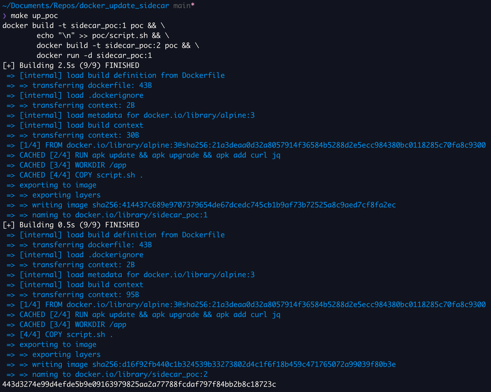
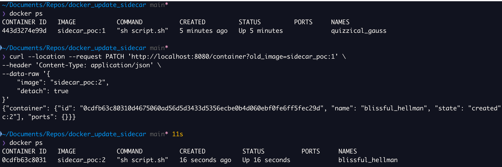

# Docker container update

Sidecar para actualizar imagenes de containers remotamente.

## Instalation

### Poetry

```bash
> poetry install && poetry run python -m app
```

### Docker

**Importante**: es importante montar el socket de docker para que el container tenga acceso al deamon del host.

```bash
> docker build -t sidecar_api .
> docker run -it -p8080:8080 -v /var/run/docker.sock:/var/run/docker.sock sidecar_api
```

## POC

**Objetivo**: actualizar de la version `sidecar:1` a `sidecar:2` mediante una request.

- Creo dos imagenes y levanto un contianer.
  

- Mediante la api acutalizo el container y valido la imagen del nuevo container.
  

## Consideraciones

Los endpoint que permiten iniciar un nuevo container pueden recibir por body todo los campos que permite la funcion [run](https://docker-py.readthedocs.io/en/stable/containers.html#docker.models.containers.ContainerCollection.run) del sdk de Docker.

